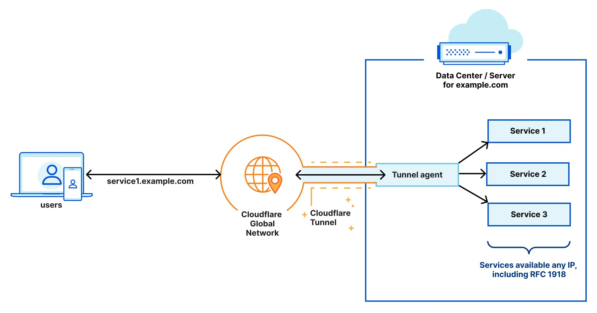

# Cloudflare Tunnel

## What is a Cloudflare Tunnel?

**Cloudflare Tunnel** securely connects your local or private services to the Cloudflare network **without opening inbound ports** on your router or firewall.  
It works by creating an outbound-only connection from your machine to Cloudflare's edge, allowing you to serve internal services (like a web app running on `localhost`) to the public internet with Cloudflare's security, DDoS protection, and optional Zero Trust access.

## How This Works

This repository includes a `docker-compose.yml` file that runs the official Cloudflare `cloudflared` agent inside a container.  
The client:

1. Authenticates with your Cloudflare account.
2. Creates an encrypted tunnel between your local service and Cloudflare's network.
3. Routes a chosen hostname (e.g. `myapp.example.com`) to your internal app.

## Prerequisites

- A [Cloudflare](https://dash.cloudflare.com/) account.
- A domain name managed by Cloudflare DNS.
- [Docker](https://docs.docker.com/get-docker/) and [Docker Compose](https://docs.docker.com/compose/) installed.

## Setup Instructions

1. Setup a cloudflare tunnel following the instructions in this video.
1. Run the local agent with docker `docker compose up -d`
